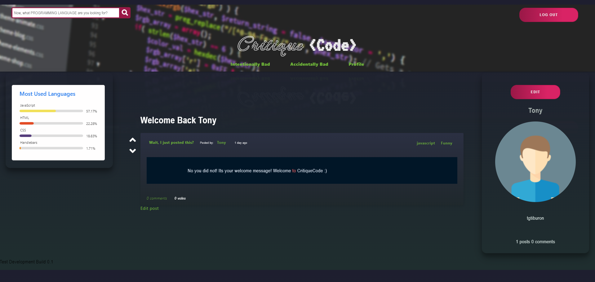

# critique-code
---

  
  
   
   
   
   
   
   
   
## Description

We're Not Stack Overflow. Welcome to Reddit uhh I mean Welcome to Critique Code. Are you tired of getting incessantly cyber-bullied on Stack Overflow? Are you tired of feeling like a terrible coder who has no business opening up their IDE everyday? Welcome to Reddit dot com Here you can write the worst code imaginable and post it for a laugh, or if that terrible code was an accident, then you can look for feed back. Are you a great coder looking to help others learn? Are you a bad coder looking to learn? Or Are you painfully average and just looking to share the dumbest for loop you could think of writing?

---
  ## Table of Contents

  [Features](#features)

  [Screenshot](#screenshot)

  [Installation](#installation)
    
  [Usage](#usage)
    
  [License](#license)
    
  [Contributing](#contributing)
    
  [Tests](#tests)

  [Questions](#questions)
  
  

---

## Features

      1. User generated data 

      2. Easy to use interface 

      3. Not stack overflow 

      4. Sortable timelines 

      5. Customizable profiles 

      6. Voting system 
---

## Screenshot 
  
  
  

  ---

  ## Installation

      1. Clone the github 

      2.  npm install 

      3.  Go to Heroku 

  &emsp; [Heroku](https://critique-code.herokuapp.com/)
   
---
  ## Usage

      1. Either go to Heroku 

      2.  Or npm start from the console 

  ---
  ## License 

  &emsp; 

      To read about the license of this project click the link below.

  &emsp;[License](https://github.com/burcarz/critique-code/blob/main/LICENSE) 

  ---
  ## Contributing

      1. Either email one of the developers, or leave a comment on the issue tracker 
---
  ## Tests
      1. npm test 

---
## Questions

If you have any questions about this project feel free to email us at

 <tg.tiburon@gmail.com>     

 <zacharyburcar@gmail.com>

 <sloan.boyce@gmail.com>  

